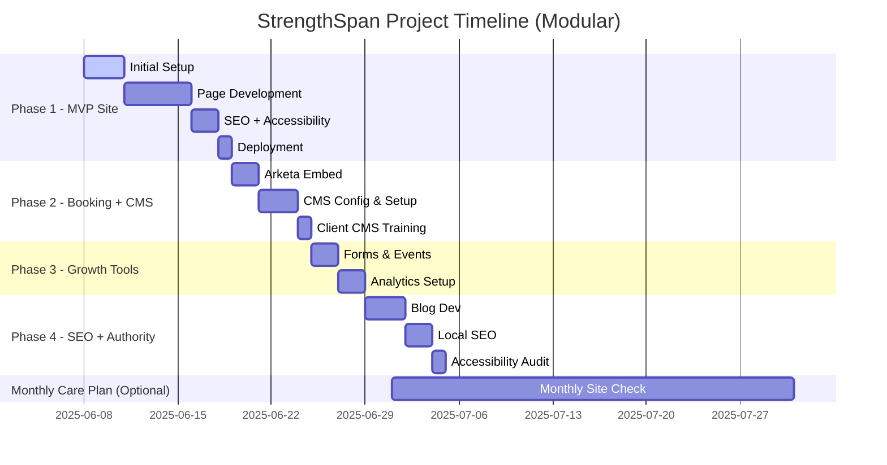

# StrengthSpan Technical Project Specification

## Project Summary
**Client**: Kay – Licensed Physical Therapist launching StrengthSpan, a wellness and strength training service for older adults.

**Goal**: Deliver a modular, scalable, senior-accessible website with embedded booking, editable content, and low-maintenance growth paths. Designed for clarity, SEO, and ease of use.

**Stack**:
- **Frontend**: Next.js (Static Site Generation with ISR ready if needed)
- **Styling**: TailwindCSS with accessibility-first defaults
- **CMS**: Decap (Netlify CMS fork) – Git-based markdown with optional file uploads
- **Hosting**: Vercel with preview deployments
- **Booking**: Arketa embedded calendar widget (requires Growth plan tier)
- **Analytics**: Google Analytics 4 (GA4) + Lighthouse reports
- **Email Marketing**: Mailchimp embedded form or API integration

**Project Trigger**: Client handoff of required assets (copy, images, logo, credentials)  
**Billing Model**: Fixed-fee, phase-based value pricing. No hourly billing. Minimum effective dev value: $60/hr.

---

## Project Timeline

---

## Phase 1 – Static MVP Site
**Objective**: Establish a reliable, accessible, professional foundation for StrengthSpan’s digital presence.

### Deliverables:
- **Pages**: Home, About, Services & Pricing, Contact
- **Static Booking Link**: Arketa external link
- **Design**: Mobile-first, senior-accessible (high contrast, large fonts, semantic markup)
- **SEO**: Meta tags, Open Graph metadata, sitemap.xml, robots.txt
- **Performance**: Fast load, Next.js Image Optimization, lazy loading
- **Hosting**: Deployed to Vercel with production and preview branches

### Required Assets:
- Logo draft or placeholder
- Therapist biography and mission
- Service and pricing descriptions
- Contact info: email, phone, optional location info

### Development Workflow:
- Scaffold using `create-next-app` w/ TypeScript
- Tailwind setup with `@tailwindcss/typography` and custom theme
- Accessible navigation and ARIA roles
- Create reusable components (`<Header/>`, `<Footer/>`, `<Card/>`)
- Lighthouse test automation setup

### Acceptance Criteria:
- WCAG 2.2 AA compliance
- Lighthouse ≥90 Accessibility + Performance
- Deployed site loads in ≤1.5s via CDN edge

---

## Phase 2 – Booking Integration + CMS Setup
**Objective**: Enhance booking UX and empower the client to manage copy/images without dev assistance.

### Deliverables:
- Embed Arketa booking widget (iframe with brand styling)
- Configure Decap CMS via `config.yml` for markdown content editing
- Editable fields: Homepage intro, About bio, Services, Testimonials (future-ready)
- File/media support via GitHub uploads
- CMS dashboard access + PDF guide + video walkthrough

### Required Assets:
- Arketa account access with embed widget enabled
- GitHub repo connected to Vercel
- Client GitHub access (or delegated push permissions)

### Development Workflow:
- Implement `/admin` route and access control
- Setup GitHub webhook for instant redeploys on commit
- Create CMS schema collections + UI preview
- Test user permissions and rollback on content changes

### Acceptance Criteria:
- Client successfully edits copy, publishes, and views update
- Embedded booking widget works across mobile and desktop

---

## Phase 3 – Growth Tools
**Objective**: Convert site visitors to leads through newsletter and waitlist signups. Establish analytics visibility.

### Deliverables:
- Waitlist form (via GetWaitlist or Formspark)
- Newsletter signup via Mailchimp embed
- GA4 setup: form submission and conversion events
- KPI reporting email (monthly summary of top pages, bounce rate, signups)

### Required Assets:
- Mailchimp account + embed code or API key
- GetWaitlist embed code
- Google account access for GA4

### Development Workflow:
- Inject GA4 with consent-based loading
- Setup custom `events.js` for tracking form submissions
- Build `useForm()` React hook for consistent logic
- Store backup responses in Vercel Edge KV (if needed)

### Acceptance Criteria:
- Working and styled forms
- Verified GA4 data on real-time dashboard
- Manual submission test + automated success email

---

## Phase 4 – Authority & Local SEO
**Objective**: Improve organic visibility, demonstrate authority, and complete accessibility compliance.

### Deliverables:
- Blog system: MDX posts via CMS, dynamic routes
- LocalBusiness schema w/ JSON-LD
- Google Business Profile setup + image optimization
- Full WCAG audit (axe-core + Lighthouse + manual testing)
- Fix: heading hierarchy, ARIA labels, keyboard nav, skip links

### Required Assets:
- 2 draft blog posts (or outlines)
- Business location/service area
- Profile images + intro copy

### Development Workflow:
- Create `pages/blog/` and `[slug].tsx` dynamic routes
- `getStaticProps` and `getStaticPaths` for SSG blog rendering
- Inject structured data on all main pages
- Generate audit reports and document remediations

### Acceptance Criteria:
- JSON-LD schema recognized in Google Rich Results
- Blog fully editable via CMS
- No critical accessibility issues remain

---

## Monthly Care Plan
**Deliverables:**
- CMS dependency updates (Next.js, Tailwind, Decap)
- Monthly Lighthouse + GA summary (PDF)
- Up to 2 minor content updates (≤30 mins each)
- Uptime + security monitoring
- Priority email support (respond within 24h)

---

## Scope Boundaries
**In Scope:**
- Static SSG builds (no serverless APIs)
- Booking embeds (Arketa)
- Git-based CMS integration
- 3rd-party embeds: Mailchimp, GetWaitlist
- Basic brand consulting (typography, palette)

**Out of Scope:**
- Logo/branding design from scratch
- HIPAA/PHI handling
- Stripe, Shopify, or payment processors
- Real-time features (chat, video, calendar logic)
- Custom animations or frontend frameworks beyond Tailwind
- Full-scale marketing copy or photography

---

## DevOps + Workflow
- GitHub (private repo, PR-based deployment)
- Vercel: branch previews, prod deploys on `main`
- CI/CD hooks: build status + Lighthouse CLI
- Issue tracking via GitHub Projects or Linear (if enabled)
- Async review cycles via Loom or Notion

---

**Maintainer**: Joshua Ramat
**Last Updated**: 6/8/2025
